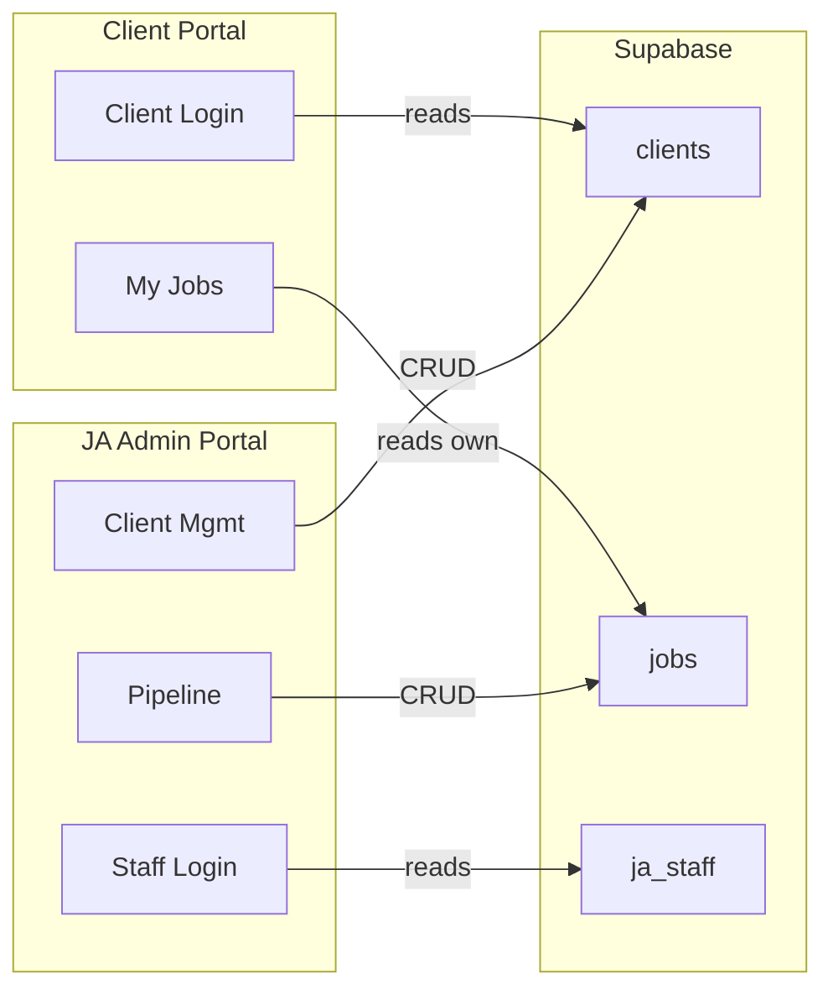

# Unified Backend Specification — JA Platform

> **Stack**: FastAPI (Python) + Supabase (Postgres) + JWT Auth  
> **Existing**: `users` table + session-based single-user auth for Job Search tool  
> **Goal**: Extend to support Client Portal + JA Admin Portal seamlessly

---

## Current State

### What Exists in Supabase Today

| Table | Purpose |
|---|---|
| `users` | Job Search tool login (`username`, `email`, `hashed_password`, `disabled`) |
| `sessions` | Active session tracking (single-user enforcement) |

### What Exists in the Backend

| Component | Details |
|---|---|
| `routes/auth.py` | `/auth/login`, `/auth/logout`, `/auth/me` — Job Search tool auth |
| `services/supabase_service.py` | CRUD on `users` table |
| `services/session_service.py` | Single-session enforcement |
| `services/auth_service.py` | `bcrypt` password hashing + JWT token creation |
| `settings.py` | `SUPABASE_URL`, `SUPABASE_KEY`, `JWT_SECRET_KEY`, `JWT_ALGORITHM` |

---

## New Supabase Tables

> [!IMPORTANT]
> The existing `users` table is for the **Job Search tool** only. The new tables below serve the **Client Portal** and **JA Admin Portal**. They are separate user pools with separate auth flows.

### 1. `clients`
The core client record — shared between Client Portal (login) and JA Admin (management).

```sql
CREATE TABLE IF NOT EXISTS clients (
  id UUID PRIMARY KEY DEFAULT gen_random_uuid(),
  name TEXT NOT NULL,
  email TEXT UNIQUE NOT NULL,       -- portal login username
  phone TEXT,
  hashed_password TEXT,             -- bcrypt, set by JA Admin
  status TEXT DEFAULT 'pending'     -- active / pending / inactive / suspended
    CHECK (status IN ('active','pending','inactive','suspended')),
  portal_access TEXT DEFAULT 'never_set'  -- configured / invited / never_set
    CHECK (portal_access IN ('configured','invited','never_set')),
  notes TEXT,                       -- internal JA notes
  invite_sent_at TIMESTAMPTZ,
  last_login TIMESTAMPTZ,
  created_at TIMESTAMPTZ DEFAULT NOW(),
  updated_at TIMESTAMPTZ DEFAULT NOW()
);

CREATE INDEX idx_clients_email ON clients(email);
CREATE INDEX idx_clients_status ON clients(status);
```

### 2. `ja_staff`
Internal JA team members who log into the Admin Portal.

```sql
CREATE TABLE IF NOT EXISTS ja_staff (
  id UUID PRIMARY KEY DEFAULT gen_random_uuid(),
  name TEXT NOT NULL,
  email TEXT UNIQUE NOT NULL,
  hashed_password TEXT NOT NULL,
  role TEXT DEFAULT 'member'         -- admin / member
    CHECK (role IN ('admin','member')),
  status TEXT DEFAULT 'pending'      -- active / pending / suspended
    CHECK (status IN ('active','pending','suspended')),
  last_login TIMESTAMPTZ,
  created_at TIMESTAMPTZ DEFAULT NOW(),
  updated_at TIMESTAMPTZ DEFAULT NOW()
);

CREATE INDEX idx_ja_staff_email ON ja_staff(email);
```

### 3. `jobs`
Jobs collected for a client. Shared between both portals.

```sql
CREATE TABLE IF NOT EXISTS jobs (
  id UUID PRIMARY KEY DEFAULT gen_random_uuid(),
  client_id UUID NOT NULL REFERENCES clients(id) ON DELETE CASCADE,
  job_title TEXT NOT NULL,
  company TEXT NOT NULL,
  location TEXT,
  apply_link TEXT,
  match_score INT DEFAULT 0         -- 0–100
    CHECK (match_score >= 0 AND match_score <= 100),
  source TEXT,                       -- 'ai_search' / 'manual_ja' / 'client_selected'
  status TEXT DEFAULT 'queued'
    CHECK (status IN ('queued','batch_active','applied','interviewing','offer','rejected')),
  week_id TEXT,                      -- e.g. '2026-W12'
  is_archived BOOLEAN DEFAULT FALSE,
  created_at TIMESTAMPTZ DEFAULT NOW(),
  updated_at TIMESTAMPTZ DEFAULT NOW()
);

CREATE INDEX idx_jobs_client ON jobs(client_id);
CREATE INDEX idx_jobs_week ON jobs(week_id);
CREATE INDEX idx_jobs_status ON jobs(status);
```

### 4. `audit_log`
Track sensitive actions (credential views, status changes).

```sql
CREATE TABLE IF NOT EXISTS audit_log (
  id UUID PRIMARY KEY DEFAULT gen_random_uuid(),
  actor_id UUID NOT NULL,           -- ja_staff.id who performed the action
  actor_email TEXT NOT NULL,
  action TEXT NOT NULL,             -- 'view_credentials' / 'reset_password' / 'suspend_client' etc.
  target_type TEXT,                 -- 'client' / 'staff'
  target_id UUID,
  metadata JSONB,
  created_at TIMESTAMPTZ DEFAULT NOW()
);

CREATE INDEX idx_audit_actor ON audit_log(actor_id);
CREATE INDEX idx_audit_target ON audit_log(target_id);
```

### RLS & Triggers (apply to all new tables)

```sql
-- Auto-update updated_at
CREATE TRIGGER update_clients_updated_at BEFORE UPDATE ON clients
  FOR EACH ROW EXECUTE FUNCTION update_updated_at_column();
CREATE TRIGGER update_ja_staff_updated_at BEFORE UPDATE ON ja_staff
  FOR EACH ROW EXECUTE FUNCTION update_updated_at_column();
CREATE TRIGGER update_jobs_updated_at BEFORE UPDATE ON jobs
  FOR EACH ROW EXECUTE FUNCTION update_updated_at_column();

-- Enable RLS
ALTER TABLE clients ENABLE ROW LEVEL SECURITY;
ALTER TABLE ja_staff ENABLE ROW LEVEL SECURITY;
ALTER TABLE jobs ENABLE ROW LEVEL SECURITY;
ALTER TABLE audit_log ENABLE ROW LEVEL SECURITY;

-- Service role full access (backend uses service_role key)
CREATE POLICY "Service role full access" ON clients FOR ALL TO service_role USING (true) WITH CHECK (true);
CREATE POLICY "Service role full access" ON ja_staff FOR ALL TO service_role USING (true) WITH CHECK (true);
CREATE POLICY "Service role full access" ON jobs FOR ALL TO service_role USING (true) WITH CHECK (true);
CREATE POLICY "Service role full access" ON audit_log FOR ALL TO service_role USING (true) WITH CHECK (true);
```

---

## API Endpoints

### Auth — Client Portal

| Method | Endpoint | Body | Returns |
|---|---|---|---|
| `POST` | `/api/client/auth/login` | `{ email, password }` | `{ access_token, token_type }` |
| `GET` | `/api/client/auth/me` | — | Client profile (id, name, email, status, preferences) |
| `POST` | `/api/client/auth/logout` | — | `{ message }` |

> Reads from `clients` table. Verifies `hashed_password` with bcrypt. Updates `last_login`. Rejects if `status = suspended`.

---

### Auth — JA Admin Portal

| Method | Endpoint | Body | Returns |
|---|---|---|---|
| `POST` | `/api/ja-admin/auth/login` | `{ email, password }` | `{ access_token, token_type, user: { name, email, role } }` |
| `GET` | `/api/ja-admin/auth/me` | — | Staff profile |
| `POST` | `/api/ja-admin/auth/logout` | — | `{ message }` |

> Reads from `ja_staff` table. Separate JWT claim: `portal: "ja_admin"`. Rejects if `status ≠ active`.

---

### Client Management (JA Admin only)

| Method | Endpoint | Purpose |
|---|---|---|
| `GET` | `/api/ja-admin/clients` | List all clients (filter: `?status=&search=`) |
| `POST` | `/api/ja-admin/clients` | Create client account |
| `GET` | `/api/ja-admin/clients/:id` | Single client profile |
| `PATCH` | `/api/ja-admin/clients/:id/status` | Suspend / reinstate / activate |
| `PATCH` | `/api/ja-admin/clients/:id/credentials` | Set/reset password (hash server-side) |
| `POST` | `/api/ja-admin/clients/:id/send-invite` | Send portal invite email |

---

### Staff Management (JA Admin only)

| Method | Endpoint | Purpose |
|---|---|---|
| `GET` | `/api/ja-admin/team` | List all staff |
| `POST` | `/api/ja-admin/team` | Create staff account |
| `PATCH` | `/api/ja-admin/team/:id/status` | Suspend / reinstate |
| `PATCH` | `/api/ja-admin/team/:id/credentials` | Reset password |

---

### Jobs / Pipeline (shared data, different views)

#### JA Admin View (full CRUD)

| Method | Endpoint | Purpose |
|---|---|---|
| `GET` | `/api/ja-admin/jobs?clientId=&weekId=&status=` | Get jobs for a client/week |
| `POST` | `/api/ja-admin/jobs` | Add manual job to client's pipeline |
| `PATCH` | `/api/ja-admin/jobs/:id` | Update status (`batch_active`, `applied`, etc.) |
| `POST` | `/api/ja-admin/jobs/archive` | Bulk archive completed jobs for a week |

#### Client Portal View (read + limited write)

| Method | Endpoint | Purpose |
|---|---|---|
| `GET` | `/api/client/jobs` | My jobs (current week + history) |
| `GET` | `/api/client/jobs/stats` | My limits: `{ used, limit, isVeteran }` |

> **Limit logic** (server-side): `created_at < 3 months ago → 80/week`, else `60/week`.  
> Client can only see their own jobs. JA Admin can see all.

---

### Dashboard Stats (JA Admin)

| Method | Endpoint | Returns |
|---|---|---|
| `GET` | `/api/ja-admin/dashboard/stats` | `{ totalClients, activeClients, totalJobsThisWeek, pendingBatch }` |

---

## How Both Portals Share Data



- **`clients`** table is the single source of truth for both portals
- **`jobs`** table is written by JA Admin (manual add) and AI search agent, read by both portals
- Client Portal authenticates against `clients.email` + `clients.hashed_password`
- JA Admin authenticates against `ja_staff.email` + `ja_staff.hashed_password`
- JWT tokens include a `portal` claim (`"client"` or `"ja_admin"`) to prevent cross-portal access

---

## Backend Implementation Checklist

### New Files to Create

| File | Purpose |
|---|---|
| `db/clients_table.sql` | SQL migration for `clients` table |
| `db/ja_staff_table.sql` | SQL migration for `ja_staff` table |
| `db/jobs_table.sql` | SQL migration for `jobs` table |
| `db/audit_log_table.sql` | SQL migration for `audit_log` table |
| `routes/client_auth.py` | Client Portal auth endpoints |
| `routes/ja_admin_auth.py` | JA Admin auth endpoints |
| `routes/ja_admin_clients.py` | Client management CRUD |
| `routes/ja_admin_team.py` | Staff management CRUD |
| `routes/ja_admin_jobs.py` | Pipeline/job CRUD |
| `routes/client_jobs.py` | Client's own job view |
| `services/client_service.py` | Client table operations |
| `services/staff_service.py` | Staff table operations |
| `services/job_service.py` | Jobs table operations |
| `dependencies/ja_auth.py` | JWT guard checking `portal: "ja_admin"` |
| `dependencies/client_auth.py` | JWT guard checking `portal: "client"` |

### Existing Files to Modify

| File | Change |
|---|---|
| `main.py` | Register new routers (`client_auth`, `ja_admin_auth`, etc.) |
| `settings.py` | Add `CLIENT_JWT_SECRET_KEY` (or reuse with portal claim) |
| `services/supabase_service.py` | Add methods for `clients`, `ja_staff`, `jobs` tables |

---

## Security Architecture

1. **Separate JWT claims**: All tokens include `portal: "client" | "ja_admin" | "job_search"` to prevent cross-portal access
2. **Password hashing**: bcrypt via existing `auth_service.get_password_hash()`
3. **Audit logging**: Every credential view/reset logs to `audit_log`
4. **RLS**: Supabase Row Level Security enabled on all tables, backend uses `service_role` key
5. **Session isolation**: Client Portal and JA Admin have independent sessions (no single-user lock like the Job Search tool)
